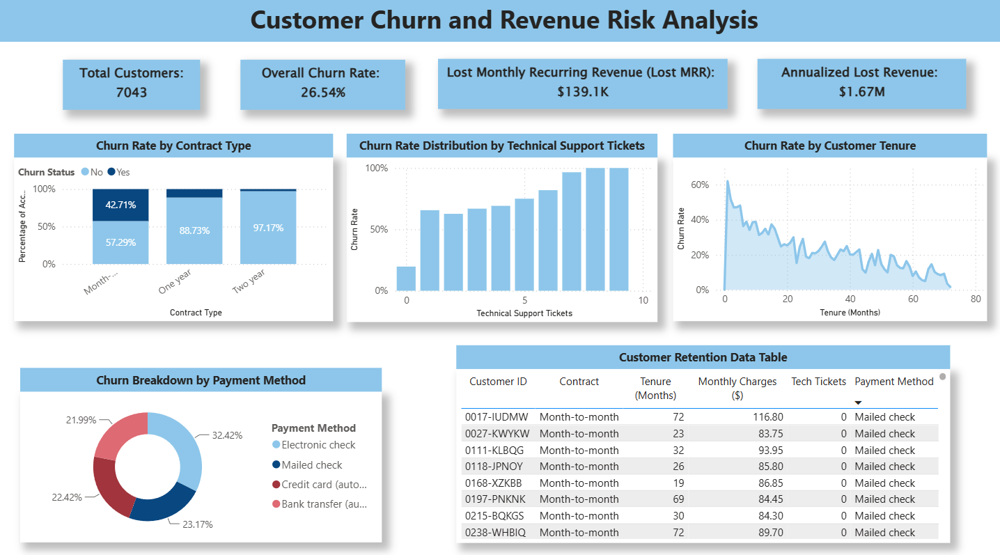

# Telco Analytics
# Customer Churn & Revenue Risk Analysis Dashboard



## 📌 Executive Summary
This project provides an executive-ready **Power BI & SQL analytics solution** investigating customer retention, monthly recurring revenue (MRR) loss, and operational risk factors across **7,043 customer accounts**. 

By engineering row-level revenue loss metrics (`lost_mrr_amount`) and key performance indicators (`churn_flag`), this analysis isolates the structural drivers of customer attrition to inform targeted retention strategies for corporate leadership.

---

## 🔑 Key Findings & Business Impact

* **Overall Company Risk Exposure:** Out of 7,043 active accounts, **1,869 customers churned (26.54% overall churn rate)**, resulting in **$139.1K in Lost Monthly Recurring Revenue (MRR)**—representing **$1.67M in annualized revenue loss**.
* **Contract Risk Concentration:** **Month-to-Month contracts** account for **~$122,000 (88%)** of total lost MRR with a **42.71% churn rate**, compared to **11.27%** for One-Year contracts and just **2.83%** for Two-Year contracts.
* **Support Friction Escalation:** Technical support tickets are a primary operational churn indicator—opening **1 tech ticket increases churn probability from ~20% to >60%**, reaching **100%** on accounts with 8+ support tickets.
* **Payment Method Exposure:** Customers utilizing **Electronic Check** represent the highest churn volume across payment channels (**32.42%** of total churned customers).

---

## 📊 Core KPI Summary Table

| Metric | Business Value | Executive Insight |
| :--- | :--- | :--- |
| **Total Customer Base** | 7,043 | Active subscriber population evaluated |
| **Overall Churn Rate** | 26.54% | Baseline benchmark across all account types |
| **Lost MRR** | $139.1K / mo | Direct monthly recurring revenue loss |
| **Annualized Lost Revenue** | $1.67M / yr | Total annual run-rate financial impact |
| **Month-to-Month Churn Rate** | 42.71% | Primary target cohort for retention campaigns |
| **Two-Year Churn Rate** | 2.83% | Benchmark for long-term contract stability |

---

## 🛠️ Data Pipeline & Technical Architecture

1. **Data Cleaning & Auditing (SQL / Python):**
   * Audited row-level integrity across 7,043 records to resolve cross-table data alignment discrepancies.
   * Standardized binary features (`Yes`/`No`, `Churned`/`Retained`) for executive readability.
2. **Data Transformation & Modeling (Power Query / DAX):**
   * Engineered custom row-level conditional logic:
     * `churn_flag` = `IF([churn] = "Yes", 1, 0)`
     * `lost_mrr_amount` = `IF([churn] = "Yes", [monthly_charges], 0)`
   * Implemented custom DAX measures for dynamic calculations of Lost MRR, Annualized Exposure, and Churn % without breaking visual context.
3. **Executive Dashboard Design (Power BI):**
   * **100% Stacked Column Chart:** Normalizes account counts across contract tiers to display true risk proportions.
   * **KPI Grid Banner:** Highlights high-level executive financial metrics ($139.1K Lost MRR, 26.54% Churn).
   * **Clustered Support Visual:** Maps churn escalation across technical support ticket volume.
   * **Drill-Through Account Directory:** Enables retention teams to inspect high-risk accounts at the granular customer level.

---

## 📁 Repository Structure

```text
Customer-Churn-Analytics/
├── data/
│   └── Customer_Churn_Dataset.xlxs        # Raw Telco dataset source
├── pbix/
│   └── Telco_Analytics.pbix               # Interactive Power BI report file
├── sql/
│   ├── telco_churn.sql                    # SQL cleaning & ETL scripts
├── screenshots/
│   └── dashboard_overview.png             # Dashboard visual for README preview
├── .gitignore                             # Temporary and OS file exclusions
└── README.md                              # Executive project documentation


